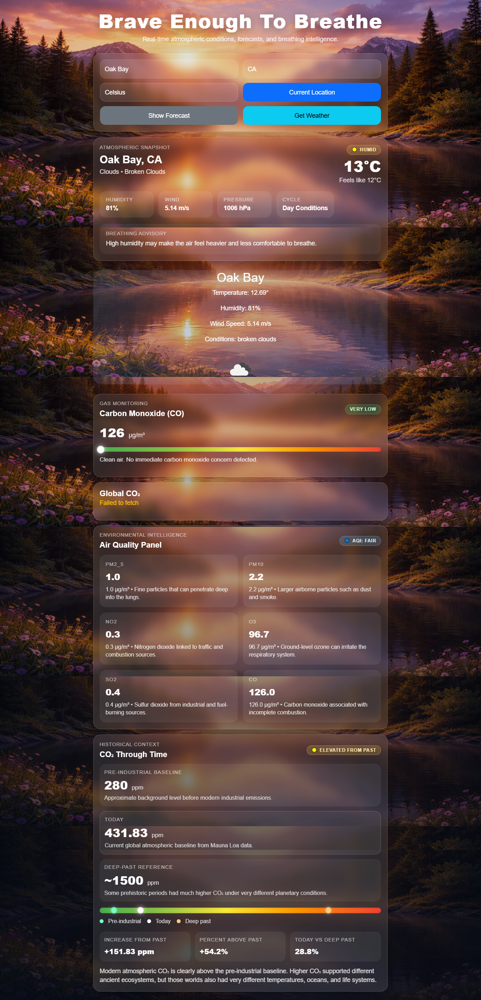

# 🌍 Be Brave To Breathe


---

## 🌐 Overview

**Be Brave To Breathe** is a full-stack atmospheric intelligence system that transforms environmental data into actionable insights.

> data → processing → insight → action

---
## 🚀 Live App

🌐 https://be-brave-enough-to-breath.netlify.app/

## 📸 Screenshot




---

## 🚀 Features

### 🌤️ Weather Intelligence
- Real-time weather lookup (city + country)
- Temperature, humidity, wind, conditions
- Dynamic atmospheric summaries

### 🌫️ Air Quality Panel
- AQI classification (Good → Hazard)
- Pollutants:
  - PM2.5, PM10
  - NO₂, O₃, SO₂, CO

### 🧪 CO Monitoring
- Carbon monoxide analysis
- Health interpretation

### 🌎 Global CO₂ Tracking
- NOAA dataset
- Daily change tracking
- Trend detection
- Backend caching

### 🧭 Atmospheric Summary
- Stable / Humid / Windy / Reduced Clarity
- Breathing advisories

---

## 🧰 Tech Stack

### Frontend
- React (CRA)
- React Bootstrap
- Testing Library

### Backend
- Node.js
- Express
- CSV parsing (NOAA)
- Caching layer

---

## 🧪 Testing

| Layer        | Coverage |
|--------------|---------|
| Unit         | ✅ |
| Components   | ✅ |
| Integration  | ✅ |
| Backend      | ✅ |


Test Suites: 11 passed
Tests: 58 passed


---

## ⚙️ Scripts

### Frontend

```bash
npm start
npm test

cd server
npm install
npm start

Runs on:
👉 http://localhost:5000

Endpoint:

GET /api/global-co2
🔑 Environment Variables
REACT_APP_OPENWEATHER_API_KEY=your_api_key_here
🧠 Architecture
User Input
   ↓
API Calls
   ↓
Processing Layer
   ↓
Insight Engine
   ↓
UI Rendering
🚀 Future Improvements
CO₂ charts
Alerts
Mobile optimization
PWA
Real-time updates
🧨 Final Note

This is not just a weather app.

It is an environmental intelligence system.

👨‍💻 Author

Full-stack systems builder specializing in:

End-to-end architecture
Real-world data systems
Environmental + telemetry platforms